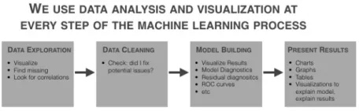

# Learning
Implementing algorithms from scratch so I can learn more about machine learning, statistics and computer science.

## Notebooks

- [Programmers Guide](programmers_guide.ipynb)
    - Distance Metrics
    - Pearson Correlation
- [Algorithms](algorithms.ipynb)
    - Binary Search
    - Recursion
    - Quicksort
- [Concepts](concepts.ipynb)

## Machine Learning Concepts

Things I'm interested in at the moment - different machine learning techniques and workflows.

### Supervised
This algorithm consist of a target / outcome variable (or dependent variable) which is to be predicted from a given set of predictors (independent variables).
- Regression
- Decision Trees/Random Forest
- KNN
- Logistic Regression
- Naive Bayes
- Gradient Boost & Adaboost

### Unsupervised
 In this algorithm, we do not have any target or outcome variable to predict / estimate.  It is used for clustering population in different groups, which is widely used for segmenting customers in different groups for specific intervention.
- Apriori algorithm
- K Means
- PCA/LDA

### Reinforcement
Using this algorithm, the machine is trained to make specific decisions. It works this way: the machine is exposed to an environment where it trains itself continually using trial and error.
- Markov Decision Process

### Basic Visualization
- Histogram
- Bar / Line Chart
- Box plot
- Scatter plot

### Advanced Visualization
- Heat Map
- Mosaic Map
- Map Visualization
- 3D Graphs
- Correlogram

## Computer Science Concepts

## Structures
Arrays, linked lists, hash tables/maps and binary trees

### Search
Breadth-first search (BFS) and depth-first search (DFS), and when to use one vs. the other

### Sorting
Merge Sort and Quicksort

### Algorithms
Do you know which algorithm is most efficient for solving a given problem? When this question comes up, keep in mind that Interviewers want to know how you approach problems, how many solutions you can come up with and how you chose the “best” option. Recursive algorithms, iterative algorithms, and greedy algorithms are among the big 3 you should know with an emphasis on recursion vs iteration.